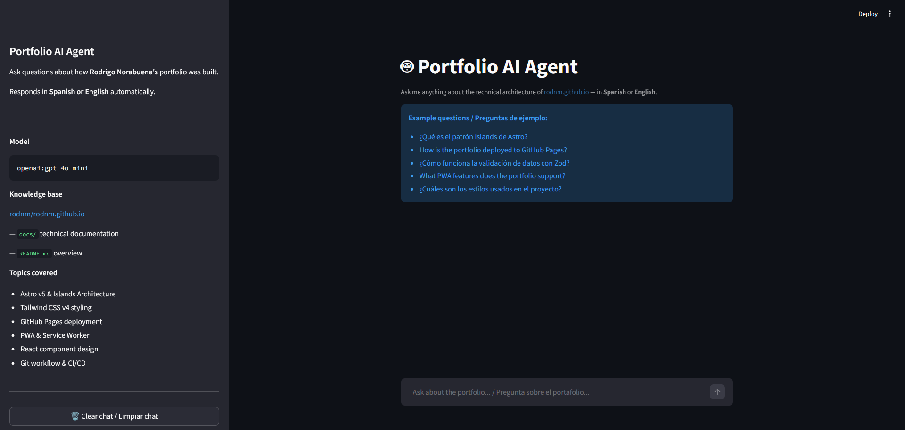

# Portfolio AI Agent

> Bilingual AI assistant that answers questions about [Rodrigo Norabuena's portfolio site](https://github.com/rodnm/rodnm.github.io) — in **Spanish or English**, automatically.

[](https://portfolio-agent.streamlit.app)
[](https://www.python.org/)
[](https://aistudio.google.com)
[](LICENSE)

---

## Overview

**What problem does it solve?**

The portfolio at [rodnm.github.io](https://rodnm.github.io) is built with Astro v5, Tailwind CSS v4, React v19, and deployed to GitHub Pages as a PWA. The `docs/` folder contains rich technical documentation — but nobody reads documentation directly.

This agent makes that documentation **conversational**: ask any question about the architecture, deployment, components, or workflow and get an accurate, sourced answer — in your language.

**Why is it useful?**

- Hiring managers can ask technical questions about the portfolio in Spanish or English
- Developers can quickly understand how the site is structured before contributing
- Demonstrates a complete RAG + agent pipeline on a real personal project

**Tech stack:**

| Component        | Technology                                  |
|------------------|---------------------------------------------|
| LLM              | Google Gemini `gemini-2.5-flash-lite` (free) |
| Agent Framework  | Pydantic AI                                 |
| Search Engine    | minsearch (BM25-style text + sliding window chunking) |
| UI               | Streamlit                                   |
| Data Source      | rodnm/rodnm.github.io `docs/`               |
| Package Manager  | uv                                          |
| Deployment       | Streamlit Cloud                             |

---

## Dataset

This project uses an **original dataset** rather than the default DataTalksClub FAQ dataset. It dynamically ingests Markdown technical documentation directly from the `docs/` and `src/content/blog/` folders of the [rodnm.github.io](https://github.com/rodnm/rodnm.github.io) repository, ensuring the AI agent answers questions based on real, live personal project data.

---

## Project Structure

```
portfolio-agent/
├── ingest.py            # Data pipeline: download → parse → chunk → index
├── search_tools.py      # SearchTool class wrapping minsearch
├── search_agent.py      # Pydantic AI agent with Gemini + bilingual system prompt
├── logs.py              # JSON interaction logging
├── main.py              # CLI interface
├── app.py               # Streamlit chat UI
├── eval/
│   ├── data-gen.ipynb   # Generate bilingual ground truth Q&A pairs
│   ├── evaluations.ipynb # Hit Rate, MRR, LLM-as-judge evaluation
│   └── ground_truth.csv # Generated evaluation dataset
├── pyproject.toml       # uv project config
├── requirements.txt     # Streamlit Cloud deployment
└── README.md
```

---

## Installation

**Requirements:** Python 3.12+, [uv](https://docs.astral.sh/uv/), a free [Gemini API key](https://aistudio.google.com/apikey)

```bash
# 1. Clone the repo
git clone https://github.com/rodnm/portfolio-agent.git
cd portfolio-agent

# 2. Install dependencies
uv sync

# 3. Set up environment variables
# Create a .env file with your GEMINI_API_KEY:
echo GEMINI_API_KEY=your_key_here > .env
# Get your free key at: https://aistudio.google.com/apikey
```

---

## Screenshot



---

## Usage

### Web Interface (Streamlit)

```bash
uv run streamlit run app.py
# Open http://localhost:8501
```

Or use the **live app**: [portfolio-agent.streamlit.app](https://portfolio-agent.streamlit.app)

### CLI

```bash
uv run python main.py

# Options:
uv run python main.py --no-chunk   # use full docs (no chunking)
uv run python main.py --top-k 3    # return top 3 search results
```

**Example interaction:**

```
You: ¿Qué es el patrón Islands de Astro?

Agent:
## El patrón Islands en Astro

El patrón Islands (Islas) es una arquitectura de Astro que permite...
[...]

**Sources:**
- [01-Arquitectura-Astro.md](https://github.com/rodnm/rodnm.github.io/blob/main/docs/01-Arquitectura-Astro.md)
```

---

## Data Pipeline

The pipeline (`ingest.py`) downloads the `rodnm/rodnm.github.io` repository as a zip archive, extracts all `.md` files from `docs/`, `README.md`, and `src/content/blog/`, parses frontmatter with `python-frontmatter`, applies a **sliding-window chunking** strategy (300 words / 150-word step), and builds a **minsearch** text index — all in memory without saving to disk.

**Why chunking?**
Splitting documents into overlapping chunks lets the search engine surface the most relevant paragraph for a query rather than ranking entire files. Each chunk inherits its parent document's `doc_id`, `title`, and `github_url` so the agent can always cite the correct source.

Result: **11 markdown files → 25 indexed chunks**

---

## Evaluations

Evaluated on **66 bilingual Q&A pairs** (33 ES / 33 EN) generated from the documentation using `eval/data-gen.ipynb`.

### Retrieval (minsearch)

| Metric      | Score |
|-------------|-------|
| Hit Rate @5 | **0.818** (81.8%) |
| MRR         | **0.541** |

### Answer Quality (LLM-as-judge with Gemini · 13 valid samples)

| Metric               | Score  |
|----------------------|--------|
| Avg Relevance (1–5)  | **3.62** |
| Avg Accuracy (1–5)   | **3.23** |
| Language Match Rate  | **84.6%** |
| Source Citation Rate | **61.5%** |

> The full 66-question LLM-as-judge run was partially affected by API rate limits (429).
> Retrieval metrics cover all 66 questions. Quality metrics reflect 13 successfully evaluated responses.
> Re-run `eval/evaluations.ipynb` with increased delays for full coverage.

---

## How It Works

```
User question
     │
     ▼
search_portfolio_docs(query)   ← Pydantic AI tool call
     │
     ▼
minsearch (BM25 over 25 chunks)
     │
     ▼
Top-5 relevant chunks returned to agent
     │
     ▼
Gemini composes bilingual answer + Sources section
```

1. **`ingest.py`** — Downloads the portfolio repo on startup, chunks the docs, builds an in-memory minsearch index.
2. **`search_tools.py`** — Wraps the index in a `SearchTool` dataclass. The `.search()` method is registered as a Pydantic AI tool so the agent can call it autonomously.
3. **`search_agent.py`** — Defines the system prompt (language detection rule, search-first rule, answer format) and initializes the Gemini agent via Pydantic AI.
4. **`logs.py`** — Writes each interaction to a JSON file in `logs/` for later analysis.
5. **`main.py`** — CLI REPL loop. Accepts `--no-chunk` and `--top-k` flags.
6. **`app.py`** — Streamlit chat UI. Uses `@st.cache_resource` so the index and agent are built once per session, not on every rerun.

---

## Course

Built as the final project for the **[7-Day AI Agents Crash Course](https://alexeygrigorev.com/aihero/)** by Alexey Grigorev.

The project implements all 7 days of the curriculum:
- Day 1–2: Data ingestion pipeline with chunking
- Day 3: Text search engine with minsearch
- Day 4: AI agent with function calling (Pydantic AI + Gemini)
- Day 5: Logging + LLM-as-judge evaluation
- Day 6: Streamlit UI + CLI interface
- Day 7: README, evaluations, deployment, sharing

---

## License

MIT © [Rodrigo Norabuena](https://github.com/rodnm)
